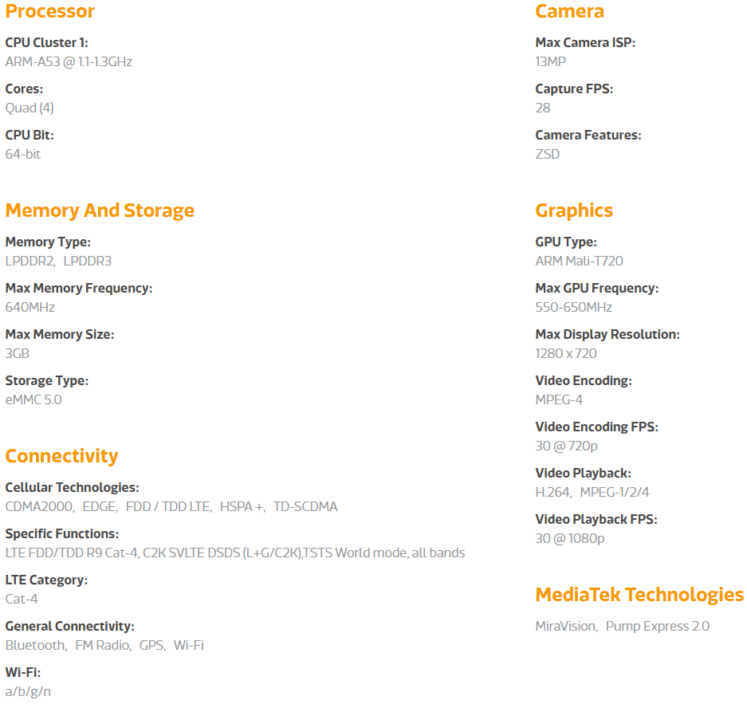

# [MT6737](https://github.com/sochub/MT6737)

[](http://www.qitas.cn) 

#### 归属：[cortex A53](https://github.com/sochub/CA53)

## [描述](https://github.com/sochub/MT6737/wiki) 

[MT6737](https://www.mediatek.com/products/smartphones/mt6737) is one of the most cost-effective R.9 Cat-4 LTE solution, MT6737 matches the value-driven market by minimizing BOM, GMO and Memory costs in addition to delivering category-leading performance and power-efficiency. 

MediaTek MT6737 also supports IMS which allows for rich network features such as VoLTE, ViLTE, VoWiFi and RCS, wherever in the world thanks to its all-band 4G modem.

Besides, MT6737 outperforms competing solutions in terms of energy-efficiency, slashing energy use by more than half in GPS and FM scenarios – and by a third in video playback or gaming scenarios. On the performance side, its quad-core 64bit CPU based on ARM Cortex-A53 and its Mali T720 MP GPU deliver sufficient performance for the top Android apps to run smoothly including popular 3D games.

[](http://www.qitas.cn) 

### 芯片型号

```

分辨率支持              QHD(540*960)       HD(1280*720)        FHD(1920*1080)
Part Number             MT6737M            MT6737A             MT6737T
C2K Version 6模         MT6737V/TM         MT6737V/TA          MT6737V/TT
LTE-FDD 5模             MT6737V/WM         MT6737V/WA          MT6737V/WT
LTE-TDD 3模             MT6737V/CM         MT6737V/CA          MT6737V/CT

```

主要特点：集成cat-4 LTE基带

功能特点：13M ISP、mali T720

主要短板：CPU主频、接口

#### [docs](docs/)

参考设计和数据手册

#### [linux](linux/)

linux系统源文件


---

###  [SoC开发平台](http://www.qitas.cn)   

###  qitas@qitas.cn